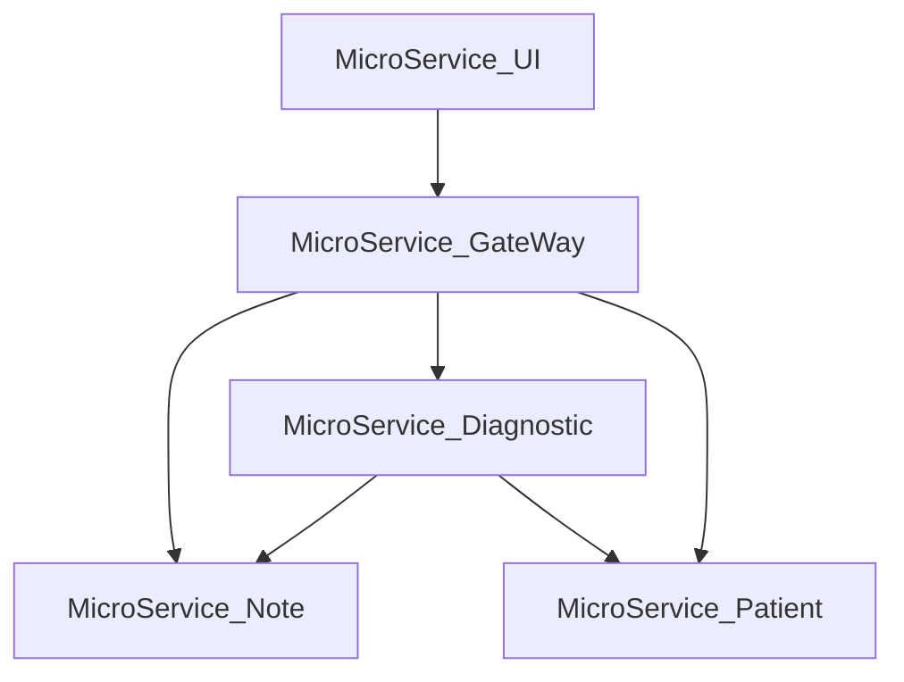

# Read Me, I'm useful.
## I - Application Name
The name of the Application is **_MedicoLabo Solutions_**.

It serves as a patient handling tool and a diabetes diagnostic tool.

## II - Description of the Application
### 2.1 What does this Application do?
This application was created by medicoLabo Solutions to handle patient history. It also provides a diagnostic tool to establish a report on the diabetes status of the patient.
It respects the MVC approach as it has controller layers for each entity (Patient, Note and so far Diagnostic) as well as repository layers to handle data persistence.
Indeed, it uses the CRUD methods to handle the entities.

The architecture of the Application follows the Edge Microservices approach as it as :
 > - a Discovery Client (Eureka)
 > - a gateway (Spring Cloud Gateway)
 > - a UI microservice that serves as a hub for all requests.
 
Bellow is the architecture of the current version of the Application.



### 2.2 Which features will we implement in the future?
We intend to develop several features to improve and expend the use of this Application.
 > - To associate each patient to a specific Doctor, so that each doctor can access its own list of patient upon signing in.
 > - To implement different services based on what profile is using the Application.
 > - To improve the front-end visuals for better clarity.


## III - Getting Started
These instructions will get you a copy of the project up and running on your local machine for development and testing purposes.
See deployment for notes on how to deploy the project on a live system.

### 3.1 Prerequisites
What software you need to use the app and how to install them:

 > - Docker Desktop (docker 27.1.1, docker-compose 2.29.1)

### 3.2 Installing
A step by step series of examples that tell you how to get a development environment running:
 #### 3.2.1 Docker Desktop
In order to launch the application, you need to install docker desktop to manage containers and docker-compose files
The [link](https://docs.docker.com/desktop/install/windows-install/) to install Docker Desktop.

 #### 3.2.2 Downloading each container
Each container is located on DockerHub and regularly updated.
If a new version is available, the new version of container will be downloaded before executing.

### 3.3 Running the Application
#### 3.3.1 Download the project.
Fork the project and clone it locally to a folder of your own choosing.

#### 3.3.2 Run the Application using docker-compose.yml
In Docker Desktop, open a terminal and place yourself at the root of the project (where the yaml file is).

Then use the command:
```
 docker-compose up
```

#### 3.3.3 Use the Application
All the containers will start one after the other.

When all containers are up and running, go to this [address](http://localhost:8080/login).

##### 3.3.3.1 Authentication
An authentication is needed to access the application.
Two users have been created so far as testing purposes :

| username    |        password |
|:------------|----------------:|
| doctorUser  |      bestDoctor |
| doctorAdmin | bestDoctorAdmin |

##### 3.3.3.2 Enjoy the Application
You will be redirected to the home page, where you can manage the different patients registered.
First time user will have no patients registered, so you will have to create one using the **_Add New Patient_** button.

## IV - Green Code Guidelines
### 4.1 What are the goals of the Green Code?

The Green Code is a way of implementing our application so that we reduce our ecological footprint and contribute to the environemental cause of numerical pollution.

### 4.2 Our Green Code rule set
In order to lighten the ecological footprint of our application, each collaborator must comply to the following guidelines:

#### Pillar 1 : Optimize functionalities
###### 1.1 Primary functionalities only
Only implement primary and useful functionalities. Secondary or almost useless functionality should be deleted

For an entity, if no Delete and Update functions are needed, then no endpoint will be created. 

###### 1.2 Economical solution
For a given functionality, the retrieved data should be **optimal** in use. For instance, if some members of a class are not used, create a specific DTO for the functionality so that no useless data is produced.


---
#### Pillar 2 : Optimize source code
###### 2.1 Implement reusable code
As often as you can, extract portion of code to create repeatable methods to save lines of code.

Instead of:
```java
public class SomeClass {
    private String firstMethod(Object object) {
        //logic 1
        //logic 2
        return someString;
    }

    private String secondMethod(Object object) {
        //logic 3
        //logic 2
        return someString2;
    }
}
```
In code:
```java
public class SomeClass {
    private String firstMethod(Object object) {
        //logic 1
        implementLogic2(5);
        return someString;
    }

    private String secondMethod(Object object) {
        //logic 3
        implementLogic2(10);
        return someString2;
    }
    private void implementLogic2(int someNumber) {
        //logic2
    }
}
```


###### 2.2 Reduce the amount of HTTP request per page

As often as you can, try to **minimize** the amount of HTTP request needed for a web page.

###### 2.3 Reduce database call
As often as you can, the database should be called upon **once** and data manipulation should be implemented inside the service layer

###### 2.4 Optimize database call
As often as you can, **optimize** the data you are requesting from the database;

Instead of:
```roomsql
    SELECT * FROM Patient
```
Use optimized request:
```roomsql
    SELECT firstname, dateOfBirth, phoneNumber FROM Patient
```

---